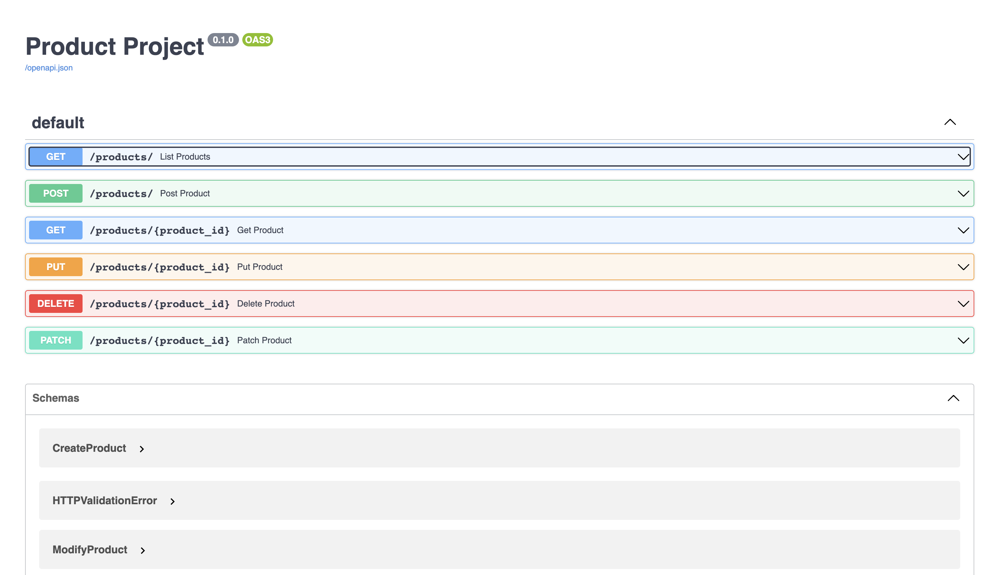
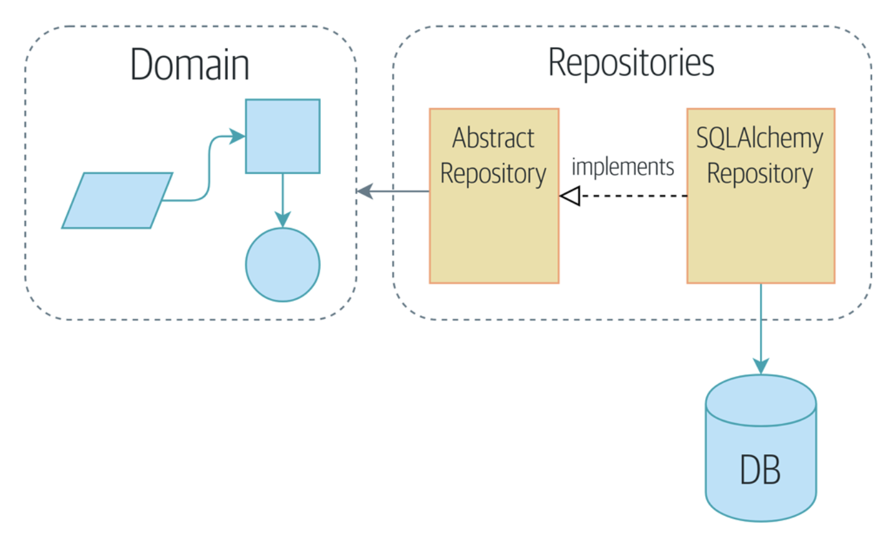

# Product API for Tekton

This is REST API
- SQLAlchemy
- SQLModel
- Postgres
- Alembic
- Docker Compose
- Rocketry
- Pydantic
- Fastapi
- Asyncpg

## How to setup the project?

You have to have Docker installed in your computer. Then, run the following commands to create the
respective container that includes a fastapi and a postgres container.

```sh
$ docker-compose up -d --build
```

To run the migrations of the database models defined in the project you must the following command
to reflect the changes to the Postgres database
```sh
$ docker-compose exec web alembic revision --autogenerate -m "new migration"
$ docker-compose exec web alembic upgrade head
```

If everything went well you should see the following website after clicking this [link](http://0.0.0.0:8004/docs)



## Project

The project has the following structure

```
.
├── LICENSE
├── README.md
├── docker-compose.yml
├── images
├── project
│   ├── Dockerfile
│   ├── alembic.ini
│   ├── app
│   │   ├── __init__.py
│   │   ├── api.py
│   │   ├── db.py
│   │   ├── main.py
│   │   ├── products
│   │   │   ├── __init__.py
│   │   │   ├── models.py # database models definition
│   │   │   ├── router.py # controller
│   │   │   ├── schemas.py # validation schemas
│   │   │   └── service.py # business logic
│   │   ├── scheduler.py # rocketry task initializer 
│   │   └── utils
│   │       ├── __init__.py
│   │       ├── base_class.py
│   │       └── config_log.ini # uvicorn config file
│   ├── logfile.log
│   ├── migrations # Alembic migrations
│   │   ├── README
│   │   ├── env.py
│   │   ├── script.py.mako
│   │   └── versions 
│   │       ├── 1e2a4d30fc67_init.py
│   │       ├── 53754b2c08a4_add_year.py
│   │       ├── 78ac71a51799_test.py
│   │       ├── 93f68f1136b8_add_year.py
│   │       └── f9c634db477d_init.py
│   ├── requirements.txt
│   └── tests
│       ├── __init__.py
│       ├── conftest.py
│       └── test_products.py
├── sql # Initializing files that will be executed when you create Postgres container
│   ├── create_tables.sql
│   ├── mock_products.csv
│   └── multiple_db.sh
└── test.http

10 directories, 35 files
```
# Architecture Layers


Where the Data Access and Persistence Layer are decoupled of the rest of the layers. So it can and easily 
change by other persistence solution.
